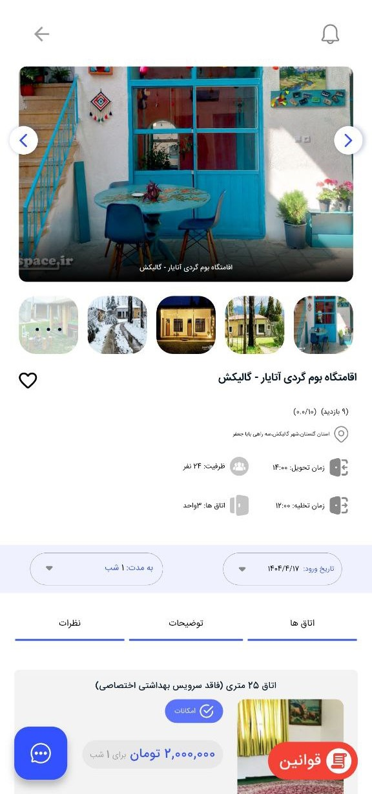
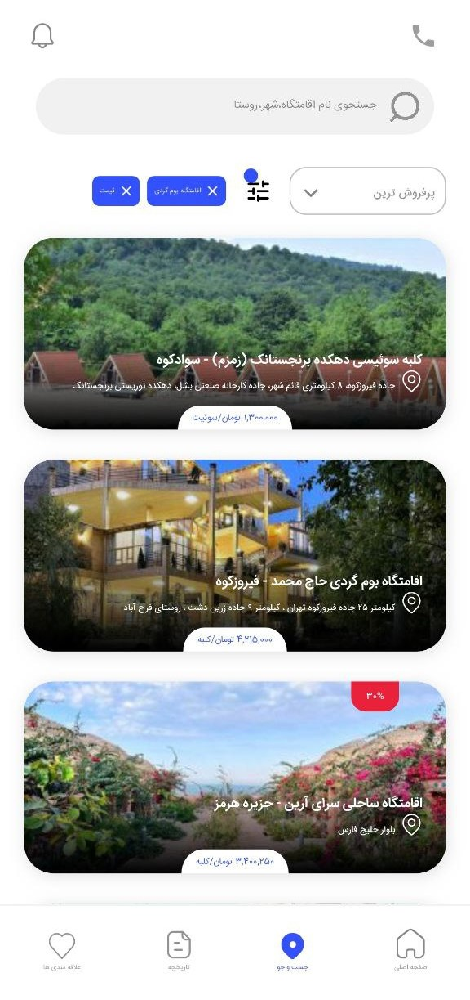
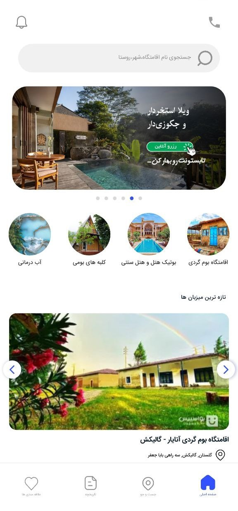
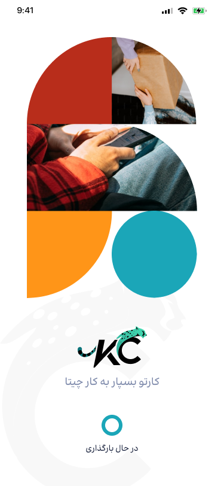
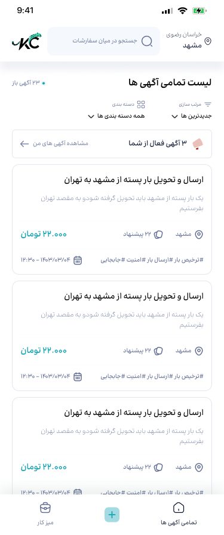
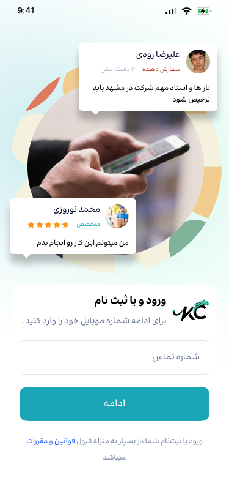

<div align="center">


# 👋 علی اصغر قاسمی  
`فلاتر دولوپر | مهندس نرم‌افزار`  
`بشرویه، خراسان جنوبی`

</div>

### 🧰 **مهارت‌های فنی**  
```dart
void main() {
  final mySkills = {
    'Mobile Development': {
      'Flutter': {
        'State Management': ['GetX', 'BLoc'],
        'Architecture': ['Clean Architecture'],
        'Networking': ['Dio', 'http'],
        'Local DB': ['Hive', 'Shared Preferences']
      }
    },
    'Tools': {
      'Version Control': ['Git (Intermediate)'],
      'IDE': [ 'Android Studio']
    },
    'Other': {
      'English': ['Technical Documentation (Intermediate)'],
      'UI/UX': ['Custom Animations', 'Material Design']
    }
  };
  print(mySkills);
}
```


## 📁 نمونه‌کارها (Projects)


<p align="right">
    <a href="https://uspace.ir" target="_blank" style="font-size: 20px; text-decoration: none; color: inherit;">
    <strong>Uspace App</strong>
  </a>
  
</p>

### توضیح کلی درباره اپلیکیشن  
اپلیکیشن Uspace یک اپلیکیشن مدیریت و رزرواسیون هتل ها و اقامتگاه ها است که امکان جستجو، مشاهده جزئیات و مدیریت علاقمندی ها را به کاربران می‌دهد. 
این اپ با هدف ارائه تجربه‌ای ساده، سریع و کاربردی در انتخاب محل اقامت طراحی شده است.

🔗 شما می‌توانید نسخه آنلاین اپلیکیشن را در لینک زیر بررسی کنید (مناسب نمایش در گوشی‌های موبایل):  
[مشاهده نسخه آنلاین](https://aliasghar144.github.io/uspace.ir.web/)  


#### 🧩 ویژگی‌ها  
- 📁 ذخیره لیست علاقه‌مندی‌ها به‌صورت **محلی** با استفاده از کتابخانه `Hive`  
- 🔍 قابلیت **جستجو و فیلتر** بر اساس عنوان و تگ‌ها  
- 🔗 پشتیبانی از **دیپ لینک (Deep Link)** برای بازگشت خودکار به اپ بعد از فرآیند پرداخت  
- ✨ طراحی مینیمال و کاربرپسند با استفاده از `Material Design`  
- ⚙️ مدیریت وضعیت و حالت‌ها با فریمورک `GetX`


<div align="center">
  
  
  
</div>

---


<p align="right">
    <a href="https://karcheetah.com" target="_blank" style="font-size: 20px; text-decoration: none; color: inherit;">
    <strong>Karcheetah App</strong>
  </a>
  
</p>

### توضیح کلی درباره اپلیکیشن  
اپلیکیشن Karcheetah یک پلتفرم فریلنسری مشابه پونیشا است که امکان ثبت پروژه برای کارفرما و ارسال پیشنهاد از سمت فریلنسرها را فراهم می‌کند. این اپلیکیشن با هدف ایجاد بستری امن، ساده و سریع برای همکاری آنلاین بین کارفرما و فریلنسر توسعه یافته است.

✅ **توسعه اپلیکیشن به‌طور کامل توسط من انجام شده و پروژه به‌صورت تیمی با همکاری شرکت ترناو اجرا شده است.**

🔗 برای آشنایی بیشتر می‌توانید به وب‌سایت رسمی مراجعه کنید:  
[karcheetah.com](https://karcheetah.com)

#### 🧩 ویژگی‌ها  
- 🔁 پشتیبانی کامل از **نقش‌های دوگانه (کارفرما / فریلنسر)** در یک اپلیکیشن  
- 📎 پیاده‌سازی **بک لینک (Deep Link)** جهت هدایت کاربران از پیامک یا ایمیل به داخل اپ  
- 🧱 معماری **Clean Architecture** برای جداسازی لایه‌ها و خوانایی بهتر کد  
- 🧠 مدیریت وضعیت با استفاده از **State Management تمیز (Clean State)**  
- 💉 استفاده از **Dependency Injection** جهت تست‌پذیری و ماژولار بودن اپلیکیشن  
- ✨ طراحی حرفه‌ای و کاربرپسند برای هر دو نقش کاربر در محیطی واحد  

<div align="center">
  
  
  
</div>

---


### 💬 راه‌های ارتباط با من 💬

<div align="center" dir="rtl">
  <div style="display: flex; justify-content: center; gap: 150px; flex-wrap: wrap;">
    <a href="mailto:aliasgharghasemi51@gmail.com">
      
    </a>    
    <a href="https://t.me/Aag144">
      
    </a>
  </div>
</div>
