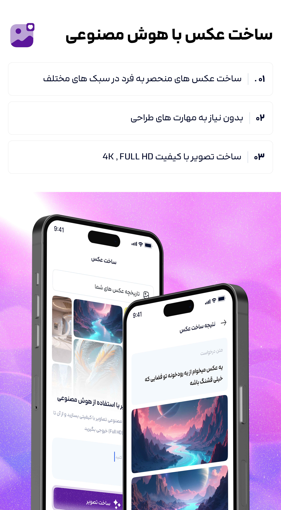
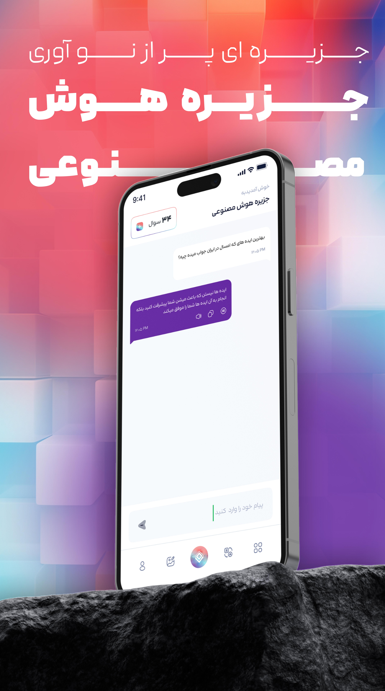
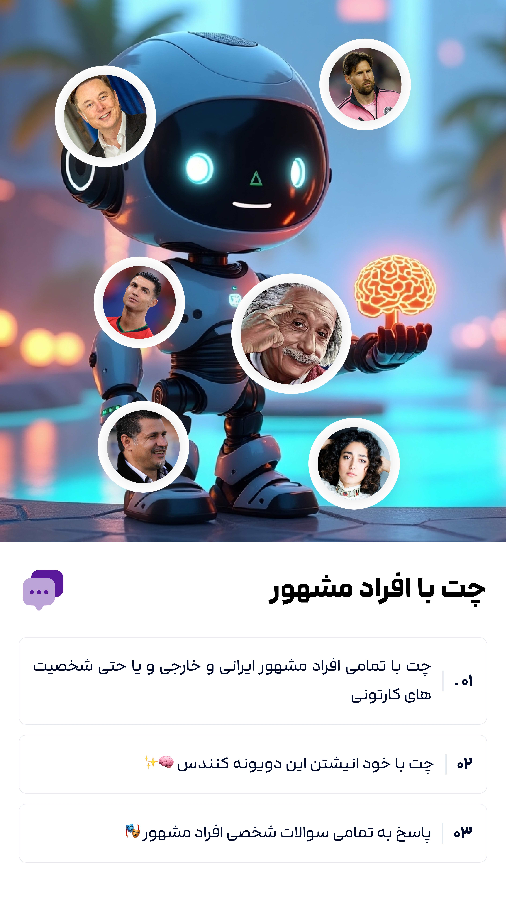
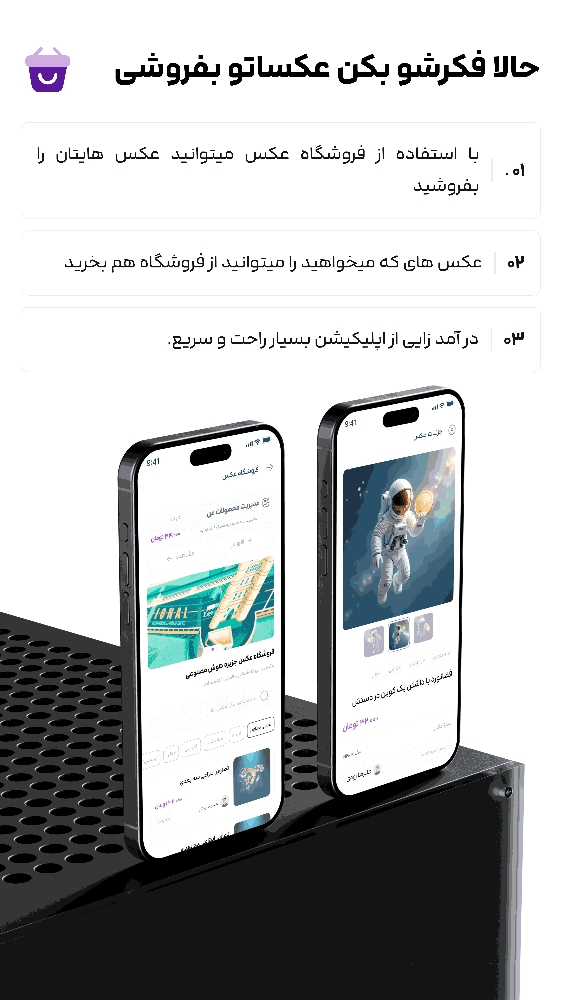

  <!-- لوگو اپ -->
  
  
  <!-- اسم اپ با لینک -->
  <h2>
    <a href="https://cafebazaar.ir/app/ir.ternav.ai_land_flutter" target="_blank">
      AiLand App
    </a>
  </h2>

<!-- ===== توضیح کوتاه ===== -->

 🌟  خلاقیتتو آزاد کن، بساز، بفروش، حال کن — همش توی جزیره!
توی "جزیره هوش مصنوعی" دنیایی از امکانات فوق‌العاده در انتظارت هست:
🎨 از متن دلخواهت عکس‌های خفن بساز!
👥 با شخصیت‌های مشهور چت کن و تجربه‌ای متفاوت داشته باش!
🛍️ تازه با فروشگاه جدیدمون می‌تونی آثار هنریت رو به نمایش بذاری و بفروشی!
🎤 مشاعره کن و مهارت شعری خودت رو محک بزن!
🌎 متون دلخواهت رو سریع و هوشمندانه ترجمه کن!

ما همیشه در حال به‌روزرسانی و اضافه کردن قابلیت‌های هیجان‌انگیزتری هستیم.
جزیره هوش مصنوعی ، جایی برای خلاقیت، سرگرمی و کسب درآمد! 🚀

<!-- ===== ویژگی‌ها ===== -->
#### 🧩 ویژگی‌ها   
- 🧱 معماری **Clean Architecture** برای جداسازی لایه‌ها و خوانایی بهتر کد  
- 🧠 مدیریت وضعیت با استفاده از **State Management تمیز (Clean State)**  
- 💉 استفاده از **Dependency Injection** جهت تست‌پذیری و ماژولار بودن اپلیکیشن  
- ✨ طراحی حرفه‌ای و کاربرپسند برای هر دو نقش کاربر در محیطی واحد
- 🌓 دارای حالت Dark/Light Mode
- 💸 سیستم پرداخت بازار
- 🔥 فایبریس نوتیفیکیشن

## 📱 دانلود اپلیکیشن

برای نصب اپلیکیشن می‌توانید از لینک‌های زیر استفاده کنید

  

<!-- ===== اسکرین‌شات‌ها ===== -->
<h3>اسکرین‌شات‌ها</h3>

  
  
  
  

