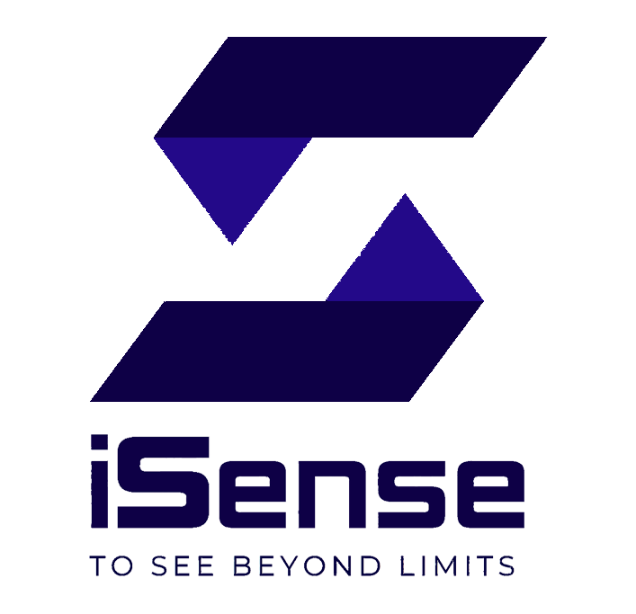
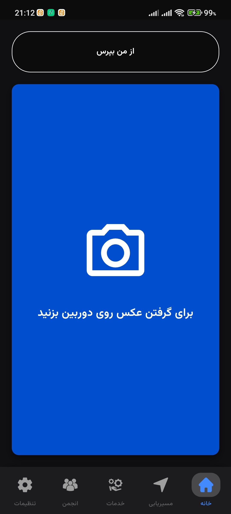
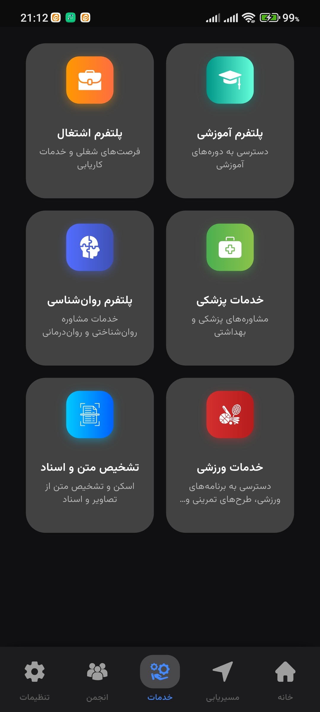

<!-- ===== اسم اپ با لینک ===== -->

  <!-- لوگو اپ -->
  
  
  <!-- اسم اپ با لینک -->
  <h2>
    <a href="#" target="_blank">
      ISense App
    </a>
  </h2>

<!-- ===== توضیح کوتاه ===== -->

  🎙️📸 اپلکیشن ISense هوش مصنوعی، دستیار نابینایان و کم بینایان

این اپلیکیشن با استفاده از دوربین و میکروفون گوشی، محیط اطراف را تحلیل کرده و نتیجه را به صورت <b>صوتی</b> و <b>متنی</b> به کاربر ارائه می‌دهد.  
کاربر می‌تواند از محیط عکس بگیرد یا سؤال صوتی بپرسد و سیستم پاسخ مناسب را از طریق سرور پردازش و ارائه می‌کند.

همچنین از یک <b>دستیار صوتی آفلاین</b> استفاده شده تا کاربر بدون نیاز به دیدن صفحه بتواند با اپ تعامل داشته باشد.

---

## 🧩 ویژگی‌ها  

📸 **تحلیل تصویر با دوربین**  
  گرفتن تصویر → ارسال به سرور → دریافت توضیح صوتی و متنی  

🎤 **پرسش و پاسخ صوتی (Voice Q&A)**  
  ضبط ویس → پردازش سرور → خروجی صوتی + متن  

🔊 **دستیار صوتی آفلاین (Local Voice Assistant)**  
  مناسب کاربران نابینا که نمی‌توانند متن روی صفحه را بخوانند  

🦯 **طراحی مناسب نابینایان**  
  دکمه‌های بزرگ، بازخورد صوتی، رابط بدون نیاز به دیدن صفحه  

⚡ **ارسال فایل سریع و پایدار**  
  مدیریت ارسال عکس و صوت با هندل خطا  

---

##  Tech Stack 🛠

| بخش | تکنولوژی |
|-----|----------|
| Mobile App | Flutter (Dart) |
| Camera & Image Processing | Flutter Camera |
| Audio Recording | Flutter Audio Recorder |
| State Management | Cubit / Bloc |
| Build Platform | Android |

---

## Project Overview 📋

اپلیکیشن ISense کمکی برای افراد نابینا و کم‌بینا است که روی استفاده از **قابلیت‌های سخت‌افزاری گوشی** تمرکز دارد:

- دوربین برای تحلیل محیط  
- میکروفون برای دریافت سؤال   

**نقش اپ:**  
- گرفتن ورودی (عکس/صوت)  
- ارسال به سرور  
- دریافت خروجی پردازش‌شده  
- تبدیل خروجی به صوت قابل فهم  
- نمایش متن برای کاربران نیمه‌بینا  

---

## ✅ Challenges & Solutions

| چالش | راه‌حل |
|-------|--------|
| استفاده از اپ بدون دیدن صفحه | افزودن TTS محلی + دکمه‌های بزرگ و لمس‌محور |
| سرعت پردازش و ارسال عکس/صوت | فشرده‌سازی مناسب + ارسال با Dio + Retry Handling |
| تجربه کاربری ویژه نابینایان | بازخوردهای صوتی و لمسی در اکثر بخش‌های مهم |

---

## 🚀 Outcome

- کاربران نابینا قادرند تنها با **یک لمس** محیط را تحلیل کنند.  
- سیستم پرسش صوتی تجربه‌ای سریع و قابل فهم ایجاد کرده است.  
- تعامل بدون نیاز به نگاه‌کردن به صفحه کاملاً امکان‌پذیر شده.  
- کاهش زمان پردازش و افزایش کیفیت خروجی صوتی.  
- اپ آماده انتشار و توسعه‌ی امکانات بیشتر است.

---

<!-- ===== اسکرین‌شات‌ها ===== -->
<h3>اسکرین‌شات‌ها</h3>

  
  
  

