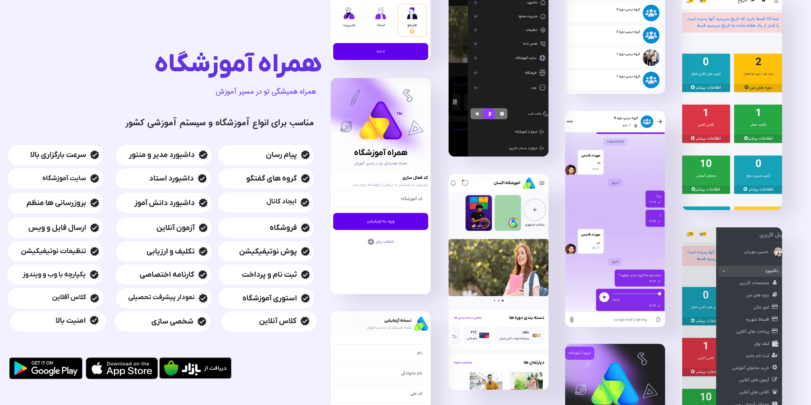
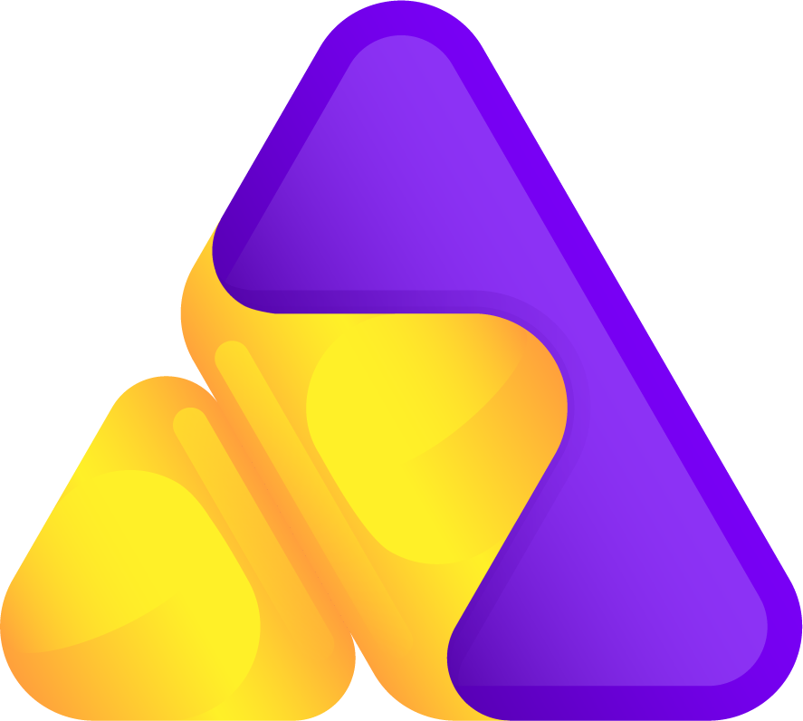
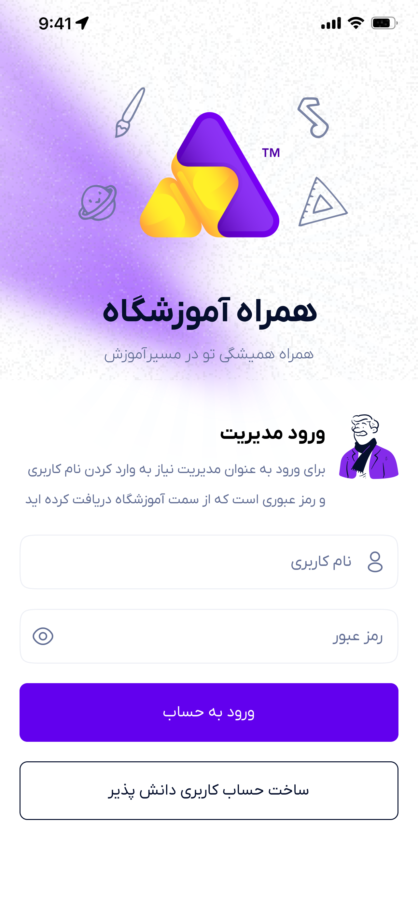
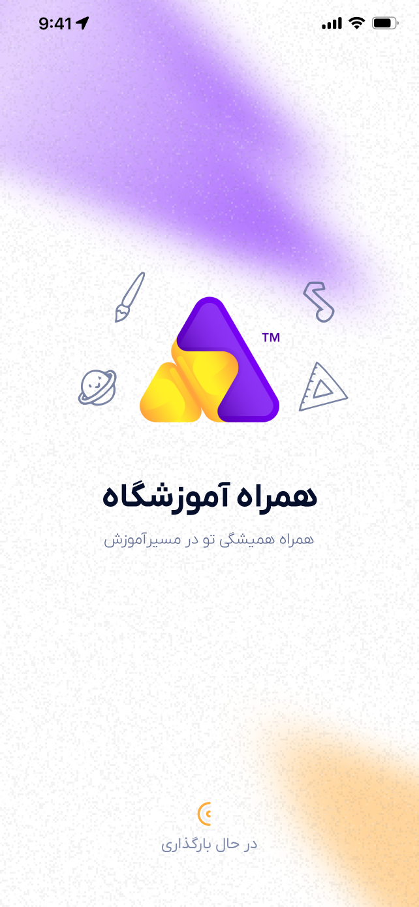
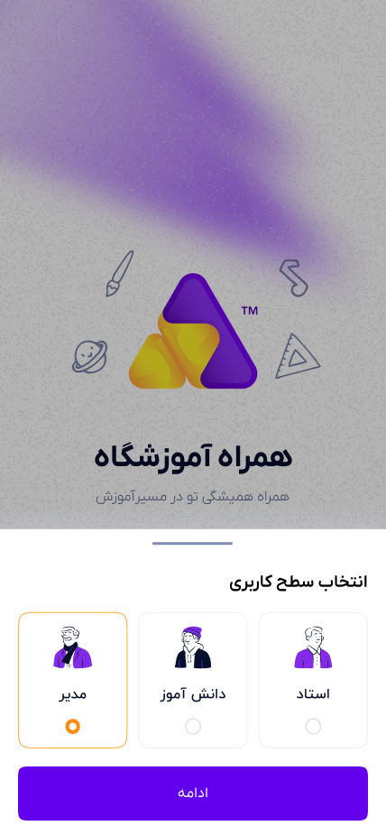
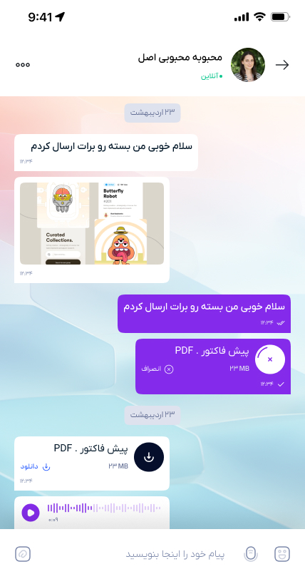
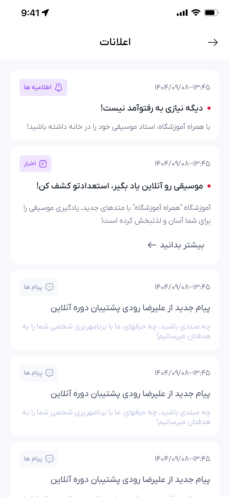
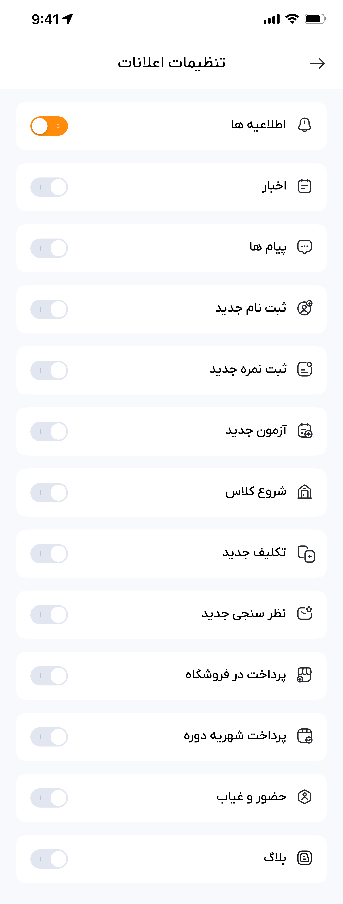

<!-- ===== بنر یا لوگو ===== -->

  

<!-- ===== اسم اپ با لینک ===== -->

  <!-- لوگو اپ -->
  
  
  <!-- اسم اپ با لینک -->
  <h2>
    <a href="https://www.acsan.ir/Product/school-mobile-application" target="_blank">
      Acsan App
    </a>
  </h2>

<!-- ===== توضیح کوتاه ===== -->

  📱 اپلیکیشن موبایل مدیریت آموزشگاه آکسان

آکسان یک سامانه جامع مدیریت آموزشگاه است که با ارائه اپلیکیشن موبایل، تجربه‌ای یکپارچه و کاربرپسند را برای مدیران، اساتید، فراگیران و پرسنل فراهم می‌کند. این اپلیکیشن با هدف تسهیل فرآیندهای آموزشی، مالی و ارتباطی در آموزشگاه‌ها طراحی شده است.

این اپلیکیشن با طراحی واکنش‌گرا و رابط کاربری ساده، تجربه‌ای روان و کاربرپسند را در اختیار تمامی اعضای آموزشگاه قرار می‌دهد.

<!-- ===== ویژگی‌ها ===== -->
#### 🧩 ویژگی‌ها  
- 🔁 پشتیبانی کامل از **نقش‌های سه گانه (دانش آموز / استاد / ادمین )** در یک اپلیکیشن  
- 🧱 معماری **Clean Architecture** برای جداسازی لایه‌ها و خوانایی بهتر کد  
- 🧠 مدیریت وضعیت با استفاده از **State Management تمیز (Clean State)**  
- 💉 استفاده از **Dependency Injection** جهت تست‌پذیری و ماژولار بودن اپلیکیشن  
- ✨ طراحی حرفه‌ای و کاربرپسند برای هر دو نقش کاربر در محیطی واحد
- 🌓 دارای حالت Dark/Light Mode
- 💬 سیستم چت RealTime (SignalR)
- 🔥 فایبریس نوتیفیکیشن

## 📱 دانلود اپلیکیشن

برای نصب اپلیکیشن می‌توانید از لینک‌های زیر استفاده کنید

  
  &nbsp;&nbsp;&nbsp;
  
  &nbsp;&nbsp;&nbsp;
  

<!-- ===== اسکرین‌شات‌ها ===== -->
## اسکرین‌شات‌ها

  
  
  

  
  
  

